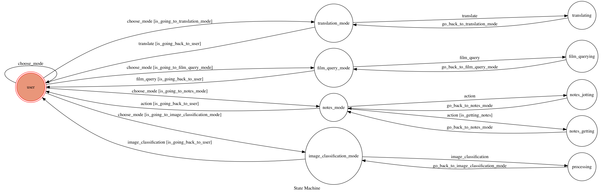

# Personal Assistant

A telegram bot based on a finite state machine, which consist of four basic functions:
- Translation mode
- Film query mode
- Notes mode
- Image classification mode

## Setup

### Prerequisite
* Python 3

#### Install Dependency
```sh
pip install -r requirements.txt
```

* pygraphviz (For visualizing Finite State Machine)
    * [Setup pygraphviz on Ubuntu](http://www.jianshu.com/p/a3da7ecc5303)

### Secret Data

- `API_TOKEN` and `WEBHOOK_URL` in app.py
- `DATABASE_INFO` in fsm.py 

**MUST** be set to proper values.

### Run Locally
You can either setup https server or using `ngrok` as a proxy.

**`ngrok` would be used in the following instruction**

```sh
ngrok http 5000
```

After that, `ngrok` would generate a https URL.

You should set `WEBHOOK_URL` (in app.py) to `your-https-URL/hook`.

#### Run the sever

```sh
python3 app.py
```

## Finite State Machine


## Usage
The initial state is set to `user`.

`user` is the initial mode of the bot. You can choose one of the modes below.

`translation_mode` - You can enter any sentenses/word to the bot (any language), if it is Chinese, the bot will translate it into English. Otherwise, all language will be translate into Chinese.
```
Chinese -> English
Any Language -> Chinese
```

`film_query_mode` - You can inquiry part of the name of the film which is playing in four Tainan theater `台南新光影城`, `台南國賓影城`, `台南大遠百威秀影城` and `台南南紡威秀影城`, then the movie time will be shown respectively.

`notes_mode` - You can just type anything to the bot. The bot will record all the data in recent 3 days. send "/p" if you want to get your data.

`image_classification_mode` - You can send any image to the bot. The bot will predict the top 5 labels that have the most highest probability.

* user
	* Input: "/t"
		* Reply: "Translate mode"

	* Input: "/f"
		* Reply: "film query mode"

	* Input: "/n"
		* Reply: "notes mode"

	* Input: "/c"
		* Reply: "image classification mode"

* translate_mode
	* Input: `ANY STRING`
		* Reply: `TRANSLATED STRING`

	* Input: "/b"
		* `BACK TO USER MODE`

* film_query_mode
	* Input: `FILM NAME`
		* Reply: `MOVIE TIME`

	* Input: "/b"
		* `BACK TO USER MODE`
		
* notes_mode
	* Input: `ANY STRING`
		* Reply: "your data has been saved into the database sucessfully!"

	* Input: "/p"
		* Reply: `DATA IN RECENT 3 DAYS`

	* Input: "/b"
		* `BACK TO USER MODE`

* translate_mode
	* Input: `IMAGE`
		* Reply: `TOP 5 PROBABILITY of WHAT IT IS`

	* Input: "/b"
		* `BACK TO USER MODE`

## Author
[laochanlam](https://github.com/laochanlam)
